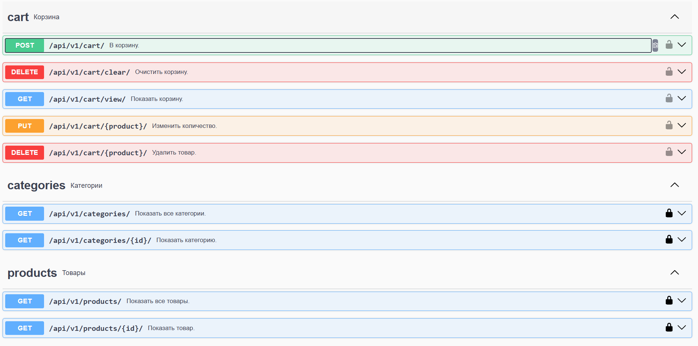
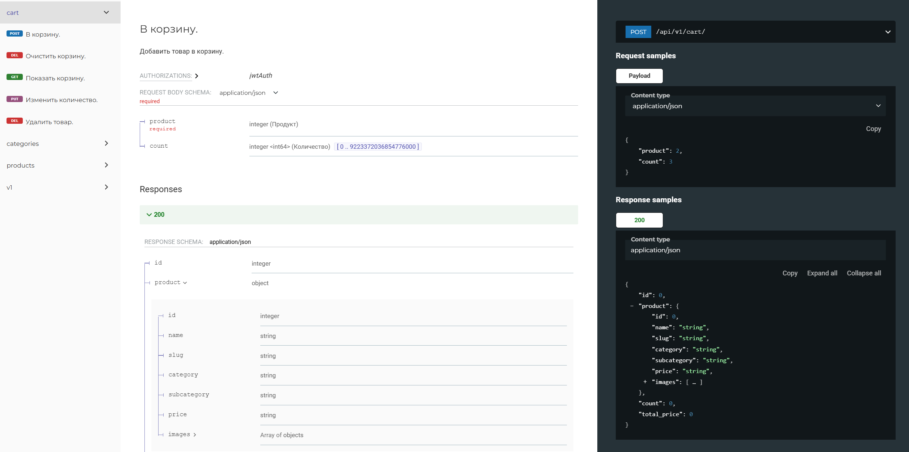

# Проект Akatosphere_Store.

Статус: В разработке.

#### Краткое описание

Проект представляет собой интернет‑магазин, в котором взаимодействие между клиентским приложением (веб‑сайт, мобильное приложение) и серверной частью реализовано через **REST API**.

На текущем этапе реализованы:

- каталог товаров;
- корзина для покупок;
- админ‑панель для управления содержимым каталога.


### Оглавление:

- [Архитектура и технологии](#архитектура-и-технологии)
- [Компоненты системы](#компоненты-системы)
  - [Каталог товаров](#каталог-товаров)
    - [`GET /api/v1/categories/` - просмотр категорий](#get-apiv1categories--просмотр-категорий)
    - [`GET /api/v1/categories/{id}/` - просмотр выбранной категории](#get-apiv1categoriesid--просмотр-выбранной-категории)
    - [`GET /api/v1/products/` - просмотр всех товаров](#get-apiv1products--просмотр-всех-товаров)
    - [`GET /api/v1/products/{id}/` - просмотр выбранного товара](#get-apiv1productsid--просмотр-выбранного-товара)
  - [Корзина](#корзина)
    - [`POST /api/v1/cart/` - добавление товара в корзину](#post-apiv1cart--добавление-товара-в-корзину)
    - [`GET /api/v1/cart/view/` - просмотр содержимого корзины](#get-apiv1cartview--просмотр-содержимого-корзины)
    - [`PUT /api/v1/cart/{product}/` - изменить количество товара в корзине](#put-apiv1cartproduct--изменить-количество-товара-в-корзине)
    - [`DELETE /api/v1/cart/{product}/` - удалить товар из корзины](#delete-apiv1cartproduct---удалить-товар-из-корзины)
    - [`DELETE /api/v1/cart/clear/` - очистка корзины](#delete-apiv1cartclear--очистка-корзины)
  - [Структура проекта](#структура-проекта)
  - [Спецификация API](#спецификация-api)
- [Запуск проекта локально](#запуск-проекта-локально)


### Архитектура и технологии

- **Backend**: Python 3.13 + Django 6.0 + Django REST Framework 3.16.
- **База данных**: SQLite (для локального запуска), PostgreSQL(в производственной среде).
- **Аутентификация клиента**: JWT + OAuth2.
- **Хранение файлов**: локальный сервер (для изображений товаров).
- **API‑документация**: OpenAPI (Swagger/Redoc).

### Компоненты системы

#### Каталог товаров

Содержит категории, подкатегории и товары. Категории: уникальность по названию, возможность загрузки изображения категории. Подкатегории: связь с категорией, уникальность по связанной категории и названию подкатегории, возможность загрузки изображения подкатегории. Товар: связь с подкатегорией, уникальность по связанной подкатегории и названию товара, возможность загрузки изображения товара. При обращении к товару, для которого загружено изображение, автоматически формируются и кэшируются для дальнейшего использования три эскиза изображения разных размеров. Эскизы формирует библиотека django-imagekit. Размеры эскизов указываются в константах SIZE_SMALL_IMAGE, SIZE_MEDIUM_IMAGE, SIZE_BIG_IMAGE в файле constants.py. SLUG генерируется автоматически.

Управление каталогом товаров выполняется из админ-панели сайта.

Просмотр каталога доступен по API любому пользователю, по эндпоинтам:

##### `GET /api/v1/categories/` - просмотр категорий
```json
response:
{
  "count": 123,
  "next": "http://api.example.org/accounts/?page=4",
  "previous": "http://api.example.org/accounts/?page=2",
  "results": [
    {
      "id": 0,
      "name": "string",
      "slug": "string",
      "image": "http://example.com",
      "subcategories": [
        {
          "id": 0,
          "name": "string",
          "slug": "string",
          "image": "http://example.com"
        }
      ]
    }
  ]
}
```

##### `GET /api/v1/categories/{id}/` - просмотр выбранной категории
```json
response
{
  "id": 0,
  "name": "string",
  "slug": "string",
  "image": "http://example.com",
  "subcategories": [
    {
      "id": 0,
      "name": "string",
      "slug": "string",
      "image": "http://example.com"
    }
  ]
}
```

##### `GET /api/v1/products/` - просмотр всех товаров
```json
response
{
  "count": 123,
  "next": "http://api.example.org/accounts/?page=4",
  "previous": "http://api.example.org/accounts/?page=2",
  "results": [
    {
      "id": 0,
      "name": "string",
      "slug": "JKf5O2YLggiqhPbaa",
      "category": "string",
      "subcategory": "string",
      "price": "string",
      "images": [
        {
	      "size": "string",
	      "url": "string"
	    }
      ]
    }
  ]
}
```

##### `GET /api/v1/products/{id}/` - просмотр выбранного товара
```json
response
{
  "id": 0,
  "name": "string",
  "slug": "string",
  "category": "string",
  "subcategory": "string",
  "price": "string",
  "images": [
    {
      "size": "string",
      "url": "string"
    }
  ]
}
```


#### Корзина

Доступ к корзине возможен только зарегистрированному пользователю по JWT токену. Пользователь после аутентификации получает доступ к своей корзине. 

Из админ-панели сайта корзины пользователей доступны только администраторам для просмотра их содержимого.

Управление корзиной доступно через API по эндпоинтам:

##### `POST /api/v1/cart/` - добавление товара в корзину

```json
request
{
	"product": 2,
	"count": 3
}
response
{
  "id": 0,
  "product": {
    "id": 0,
    "name": "string",
    "slug": "string",
    "category": "string",
    "subcategory": "string",
    "price": "string",
    "images": [
      {
        "size": "string",
        "url": "string"
      }
    ]
  },
  "count": 0,
  "total_price": 0
}
```

##### `GET /api/v1/cart/view/` - просмотр содержимого корзины

```json
response
{
  "cart": [
    {
      "id": 0,
      "product": {
        "id": 0,
        "name": "string",
        "slug": "string",
        "category": "string",
        "subcategory": "string",
        "price": "string",
        "images": [
          {
            "size": "string",
            "url": "string"
          }
        ]
      },
      "count": 0,
      "total_price": 0
    }
  ],
  "total_in_cart": {
    "total_quantity": 0,
    "total_amount": 0
  }
}
```

##### `PUT /api/v1/cart/{product}/` - изменить количество товара в корзине

```json
request
{
  "count": 5
}

response
{
  "id": 0,
  "product": {
    "id": 0,
    "name": "string",
    "slug": "string",
    "category": "string",
    "subcategory": "string",
    "price": "string",
    "images": [
      {
        "size": "string",
        "url": "string"
      }
    ]
  },
  "count": 0,
  "total_price": 0
}
```

##### `DELETE /api/v1/cart/{product}/` - удалить товар из корзины

##### `DELETE /api/v1/cart/clear/` - очистка корзины

#### Структура проекта

```c
+---akatosphere_store            каталог проекта
|   |   settings.py              настройки проекта
|   |   urls.py                  головной urls проекта
|   |   ...
|           
+---api                          приложение API
|   |   ...
|           
+---cart                         приложение корзины
|   |   ...
|           
+---catalog                      приложение каталога товаров
|   |   ...
|           
+---fixtures
|       full_no_image_db.json    фикстуры для загрузки в БД
|       
+---media
|   +---CACHE
|   |   \---catalog
|   |       \---products         кэшированные эскизы изображений товаров
|   |           ...
|   |                   
|   \---catalog
|       +---categories            оригиналы изображений категорий и подкатегорий
|       |       ...
|       |
|       |
|       \---products              оригиналы изображений товаров
|               ...
|               
+---tests                         тесты
|   |...
|           
+---users                         приложение users
|   |...
|
|   .env.example                  переменные окружения пример для файла .env
|   constants.py                  константы проекта
|   manage.py
|   pytest.ini                    настройки тестов
|   requirements.txt              файл с зависимостями
|   utils.py                      утилиты
|       
```

#### Спецификация API

Для документирования API используется библиотека drf-spectacular.

Ссылки на документацию:

`/api/docs/` - в формате Swagger



`/api/redoc/`- в формате Redoc



`/api/schema/` - ссылка для скачивания спецификации OpenApi 

### Запуск проекта локально

1. Клонируйте репозиторий и перейдите в папку проекта:
    
    ```shell
    git clone https://github.com/kom-ae/akatosphere_store
    cd akatosphere_store
    ```
    
2. Создайте и активируйте виртуальное окружение:
    
    Для Linux/macOS:
    
    ```shell
     python3 -m venv venv
     source venv/bin/activate
    ```
    
    Для Windows:
    
    ```shell
     python -m venv venv
     source venv/Scripts/activate
    ```
    
3. Обновите pip:
    
    ```shell
     python -m pip install --upgrade pip
    ```
    
4. Установите зависимости:
    
    ```shell
    pip install -r requirements.txt
    ```
    
5. Примените миграции:

    ```shell
    python manage.py migrate
    ```

7. Загрузите фикстуры:
    
    ```shell
    python manage.py loaddata fixtures/full_no_image_db.json
    ```

6. Создайте и укажите значения в файле `.env`:

    ```shell
    cp .env.example .env
    ```

7. Создайте суперпользователя:
    
    ```shell
    python manage.py createsuperuser
    ```
    
8. Запустите проект:
    
    ```shell
    python manage.py runserver
    ```
    
9. Запустите веб-браузер и введите в адресную строку:
    
    `http://127.0.0.1:8000/admin/` - админ-панель проекта

    `http://127.0.0.1:8000/api/docs/` - API спецификация в формате Swagger

    `http://127.0.0.1:8000/api/redoc/` - API спецификация в формате ReВoc

    Используйте эндпоинты API указанные выше.

    Прежде чем посылать запросы для управления корзиной, получите токен используя эндпоинт:

    `POST /api/v1/jwt/create/` - получение JWT токена

    ```json
    request
    {
      "username": "string",
      "password": "string"
    }

    response
    {
      "access": "string",
      "refresh": "string"
    }
    ```


Автор проекта: [Александр Комаров](https://github.com/kom-ae/)
